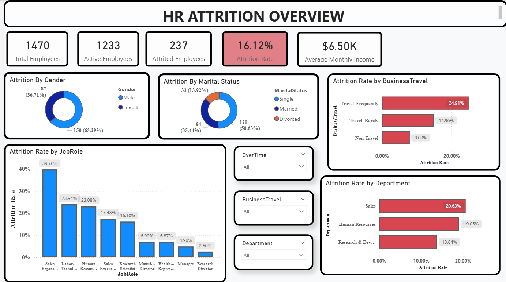

# HR Attrition & Workforce Dynamics Analysis

Identifying the true drivers of voluntary employee attrition using SQL, Python (EDA), and Power BI.

## Overview
A data-driven investigation into rising employee turnover at a mid-sized enterprise. Replaces conflicting management theories (pay, burnout, promotions) with evidence-based findings and prioritized retention recommendations, delivered as a Jupyter Notebook analysis and a Power BI dashboard.

## Business Problem Statement
At **Apex Solutions** (a mid-sized corporate enterprise), voluntary employee turnover has spiked unexpectedly, pushing the annual attrition rate to an unsustainable level. Losing experienced employees is not just an administrative hurdle; it severely impacts team productivity, increases recruitment and onboarding overhead, and drains institutional knowledge.

The Chief Human Resources Officer (CHRO) and department heads are currently operating in the dark. They are facing conflicting theories from various managers—some believe departures are driven purely by compensation gaps, others point fingers at burnout from heavy overtime, and some suspect that a lack of career progression and long promotion cycles are pushing talent out the door. Without clear, data-driven answers, the company risks wasting budget on generic retention programs that fail to address the root causes.

## The Analytical Objective
As the Data Analyst, your mission is to investigate historical employee data to move past guesswork and uncover the actual catalysts of voluntary turnover. Specifically, this project aims to:

1. **Identify High-Risk Profiles:** Determine which departments, job roles, and demographic segments experience the highest attrition rates.
2. **Examine Workplace Stressors:** Quantify the direct impact of operational factors such as mandatory overtime, compensation slabs, and distance from home on employee resignation decisions.
3. **Analyze Career Stagnation:** Evaluate whether a lack of internal mobility and prolonged time since the last promotion correlate with higher turnover.
4. **Deliver Actionable Recommendations:** Translate analytical findings into strategic, cost-effective interventions that leadership can implement to protect the company's talent pipeline.

## Dataset
| | |
|---|---|
| Source | MySQL (`hr_analytics.employee_attrition`) |
| Size | 1,470 rows × 28 columns |
| Missing values | None |
| Target | `Attrition` (Yes/No) |
| Key features | Department, JobRole, MonthlyIncome, OverTime, DistanceFromHome, BusinessTravel, EnvironmentSatisfaction, JobSatisfaction, WorkLifeBalance, StockOptionLevel |
| Engineered features | `IncomeBand`, `Distance_Group`, `Age_Group`, `Hike_Group`, `Stock_Label` |

## Tools & Technologies
`MySQL` 
`Python` (`pandas`, `numpy`, `matplotlib`, `seaborn`, `mysql-connector-python`) 
`Jupyter Notebook`
`Power BI`

## Methods
1. Extracted data from MySQL via SQL query
2. Cleaned and engineered features (income bands, distance/age/hike groups)
3. Univariate & bivariate EDA on attrition drivers
4. Multivariate testing of 5 targeted business hypotheses
5. Built an interactive Power BI dashboard for stakeholders

## Key Insights
| Driver | Finding |
|---|---|
| Overall attrition | 16.1% |
| Overtime | 30.5% attrition (vs. 10.4% without) — the single strongest driver |
| Overtime + Low Income | 53.3% attrition — highest-risk combination |
| Department | Sales highest (20.6%), R&D lowest (13.8%) |
| Job role | Sales Representative highest at 39.8%; management roles most stable (<6%) |
| Environment satisfaction | Buffers low task satisfaction, but doesn't eliminate risk |
| Travel + poor work-life balance | Attrition peaks near 46% |
| Stock options | Cuts low-income attrition from ~37% to ~17–21%, but doesn't replace salary |
| Salary hike % | No meaningful effect on attrition |

## Dashboard

`HR_Attrition.pbix` — interactive Power BI report covering headcount vs. attrition, department/role breakdowns, and key driver visuals. Open in Power BI Desktop to explore.

## How to Run
```bash
# 1. Clone
git clone https://github.com/Ranak5/<repo-name>.git
cd <repo-name>

# 2. Load employee data into MySQL as hr_analytics.employee_attrition

# 3. Set DB credentials
export HR_DB_PASSWORD="your_password"

# 4. Install dependencies
pip install pandas numpy matplotlib seaborn mysql-connector-python jupyter

# 5. Run
jupyter notebook HR_Attrition.ipynb
```
Open `HR_Attrition.pbix` in Power BI Desktop for the dashboard.

## Results & Conclusion
Attrition is concentrated in specific, identifiable risk profiles — overtime workers, low-income employees, long commuters, frequent travelers with poor work-life balance, and entry-level Sales roles. Compensation and workload are the primary levers; satisfaction and environment act as secondary buffers.

**Recommendations:** control overtime → review low-income compensation → reduce unnecessary travel → improve career mobility → target high-risk roles (Sales) with incentives.

## Future Work
- Build a predictive attrition risk model (logistic regression / tree-based classifier)
- Validate hypotheses statistically (chi-square tests)
- Automate the SQL → Python → Power BI refresh pipeline

## Author
**Ranak Maity**
[GitHub](https://github.com/Ranak5) 
[LinkedIn](https://www.linkedin.com/in/ranak-maity/) 
[LeetCode](https://leetcode.com/u/Ranak5_Maity/)